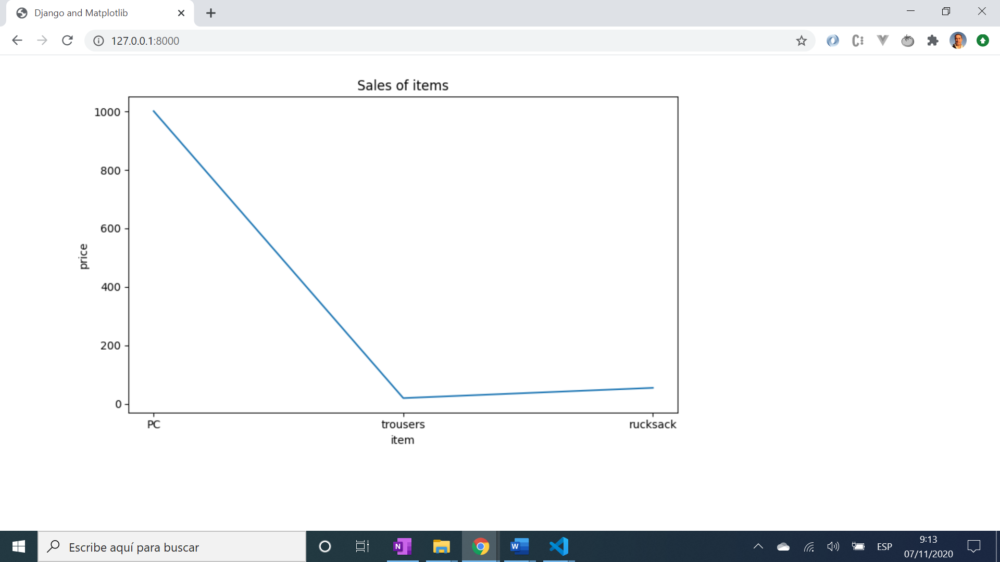

# :zap: Python Django Matplotlib

* Python-Django app using [Matplotlib](https://matplotlib.org/faq/usage_faq.html) to plot simple x,y data
* Code from a tutorial by [Pyplane](https://www.youtube.com/channel/UCQtHyVB4O4Nwy1ff5qQnyRw) - see [:clap: Inspiration](#clap-inspiration) below
* **Note:** to open web links in a new window use: _ctrl+click on link_


## :page_facing_up: Table of contents

* [:zap: Python Django Matplotlib](#zap-python-django-matplotlib)
  * [:page_facing_up: Table of contents](#page_facing_up-table-of-contents)
  * [:books: General info](#books-general-info)
  * [:camera: Screenshots](#camera-screenshots)
  * [:signal_strength: Technologies](#signal_strength-technologies)
  * [:floppy_disk: Setup](#floppy_disk-setup)
  * [:computer: Code Examples](#computer-code-examples)
  * [:cool: Features](#cool-features)
  * [:clipboard: Status & To-do list](#clipboard-status--to-do-list)
  * [:clap: Inspiration](#clap-inspiration)
  * [:envelope: Contact](#envelope-contact)

## :books: General info

* [matplotlib.pyplot](https://matplotlib.org/api/_as_gen/matplotlib.pyplot.html?highlight=pyplot#module-matplotlib.pyplot) interface used to create plots
* Be careful if printing image data, as shown in tutorial, I filled up my console with print data and had to exit the server :-)

## :camera: Screenshots



## :signal_strength: Technologies

* [Python v3](https://www.python.org/) programming language
* [Django v3](https://www.djangoproject.com/) server-side web framework
* [Matplotlib v3](https://pypi.org/project/matplotlib/) pip python plotting package
* [base64 data encoding](https://docs.python.org/3/library/base64.html) used to encode data to printable ASCII characters
* [BytesIO](https://docs.python.org/3/library/io.html?highlight=bytesio#io.BytesIO) binary stream using an in-memory bytes buffer

## :floppy_disk: Setup

* [Install Python](https://docs.python-guide.org/starting/installation/)
* [Install pip](https://docs.python-guide.org/dev/virtualenvs/#installing-pipenv)
* [Install Django](https://docs.djangoproject.com/en/3.1/howto/windows/) by typing `pip install Django`
* Run `django-admin startproject sales_proj` to create a new project [ref. docs](https://docs.djangoproject.com/en/3.1/intro/tutorial01/)
* Open `qrcode_proj` in VS Code
* Run `python manage.py startapp sales` to create Python module
* Add pip modules & code
* Run `pip freeze` to see list of modules installed. [Ref. Docs](https://pip.pypa.io/en/stable/reference/pip_freeze/)
* Run `python manage.py makemigrations` for changes to models etc.
* Run `python manage.py migrate` to migrate the migration files.
* To add a superuser run `python manage.py createsuperuser --username=joe --email=joe@example.com` [Ref. Docs](https://docs.djangoproject.com/en/3.1/topics/auth/default/) and log into admin panel
* Run `python manage.py runserver` to run server on port 8000. A refresh is needed after any code changes

## :computer: Code Examples

* extract from `utils.py` - to get plot data and display it with some of the many matplotlib options set

```python
def get_plot(x,y):
  plt.switch_backend('AGG')
  plt.figure(figsize=(8,5))
  plt.title('Sales of items')
  plt.plot(x,y)
  plt.xticks(rotation=0)
  plt.xlabel('item')
  plt.ylabel('price')
  plt.tight_layout()
  graph = get_graph()
  return graph
```

## :cool: Features

* Use of matplotlib.pyplot in ``utils.py; a state-based interface to matplotlib with a MATLAB-like way of plotting.

## :clipboard: Status & To-do list

* Status: working
* To-do: Nothing. Good sandbox to try with other data & layouts etc.

## :clap: Inspiration

* [Pyplane: Youtube: | Django and matplotilb integration | How to use matplotlib with Django](https://www.youtube.com/watch?v=jrT6NiM46jk&t=125s)

## :file_folder: License

* N/A

## :envelope: Contact

* Repo created by [ABateman](https://github.com/AndrewJBateman), email: gomezbateman@yahoo.com
